# HOMEWORK4:薛定谔方程
## A.非简谐振子
### 1.数值求解方法
此题为边界问题，要求满足在边界处：
$$\lim_{x \to \infty} \phi(x,t) = 0$$
此外，还要保证波函数的归一化
#### 算法一
为了数值求解，不妨认为存在$L$足够大，使得：
 $$ \phi(L,t) \approx 0 $$ 和 $$\phi(-L,t) \approx 0 $$其中 \( L \) 足够大以覆盖波函数的主要分布范围。
 这是一个本征值问题：只有当 \( E \) 是某些特殊值（本征值）时，这个边值问题才有非零的解（波函数）。
 所以，我们可以使用基于割线法和龙格库塔法结合（打靶法）的思想解决问题：
 1. 首先要利用量子力学的一个结论，对于势函数为偶函数的情况下，基函数、偶数级激发态的波函数为偶函数，奇数级激发态为奇函数。
 2. 将问题转化为初值问题
  猜测一个E的值，我们可以设置初值条件 
  - 基态或者偶数级激发态：\( \psi(0) = 1 \)（或其他非零值，数值计算时不影响归一化）和 \( \psi'(0) = 0 \)。 
  - 奇数级激发态：\( \psi(0) = 0 \) 和 \( \psi'(0) = 1 \)（或其他非零值，数值计算时不影响归一化）
3. 使用数值方法（四阶龙格-库塔法）从 \( x = 0 \) 积分到 \( x = L \)。
4. 检查边界 \( \psi(L) \) 是否接近零。如果结果不满足边界条件，使用割线法调整$E$的值。定义$f(E ) = \psi(L)$，则$$E_{n+1} = E_n - \frac{E_{n}-E_{n+1}}{f(E_n) - f(E_{n-1})}f(E_{n})$$
5. 对于新的E的值，回到步骤2，如此迭代，直到满足边界条件
6. 最后，对于找到的E，得出波函数，对波函数进行归一化处理。

写出相关代码进行数值计算，其中用到的割线法和龙格库塔法已在前面的作业中写过。具体代码实现详见附录。
#### 算法二
此算法同老师上课所讲算法。
1. 选择数值解的区域。该区域应足够大，以确保相较于势函数的有效区域，边界处波函数的影响可忽略不计。（思想同算法一中的L）

2. 对最低本征值提供一个合理的猜测。猜测的初始值应该尽可能接近正确值，可以降低运算时间

3. 积分波函数。

- 从左侧将$\phi_l(x)$从$x=x_l$处积分到$x=x_r+h$  ；

- 从右侧将$\phi_l(x)$从$x=x_r$处积分到$x=x_l-h$；

- 将初始点处的波函数值设为零，并在积分起始点对波函数值进行rescale,确保$\phi_l(x_r)=\phi_r(x_r)$。

4. 计算匹配函数：
$$f(\varepsilon_0)=\frac{[\varphi_r(x_r-h)-\varphi_r(x_r+h)]-[\varphi_l(x_r-h)-\varphi_l(x_r+h)}{2h\varphi_r(x_r)}$$

5. 使用割线法找到 $f(\varepsilon_0)=0$ 的解。通过割线法逐步调整$\varepsilon$的值，直至满足给定的容忍度。

6. 求解下一个本征值。为了找到下一个本征值，可以从一个略高于上一个本征值的起始值开始搜索。(可以通过检查波函数的节点数来判断是否有遗漏的本征能量)
#### 算法三

也可以将[-L,L]的位移x离散化，得到一个矢量$\vec{\phi}(x)$。
将薛定谔方程写成差分的格式：
$$-\frac{\hbar^2}{2m}[\frac{\phi(x_i-\Delta x)-2\phi(x_i)+\phi(x_i+\Delta x)}{{\Delta x}^2}] + V(x)\phi(x) = E\phi(x)$$
得到矩阵形式：
得到矩阵方程

$$\left[\begin{array}{cccccc} A(x_1) & B & 0 & \cdots & 0 \\ B & A(x_2) & B & 0 & \cdots & 0 \\ 0 & B & A(x_3) & B & 0 & \cdots \\ \vdots & \vdots & \vdots & \ddots & \vdots & \vdots \\ 0 & 0 & 0 & \cdots & B & A(x_l) \end{array}\right] \left[\begin{array}{c} \psi(x_1) \\ \psi(x_2) \\ \psi(x_3) \\ \vdots \\ \psi(x_l) \end{array}\right] = 0$$

其中

$$A(x_i) = \frac{1}{\Delta x^2} + V(x_i) - E, B = -\frac{1}{2\Delta x^2}$$

则E为该矩阵的本征值，求本征值即可。

### 2.计算基态能量
代码见附录，得到的基态能量为0.5594:
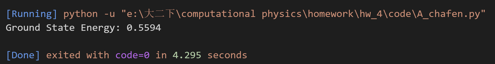
得到基态波函数的绝对值的图像为：

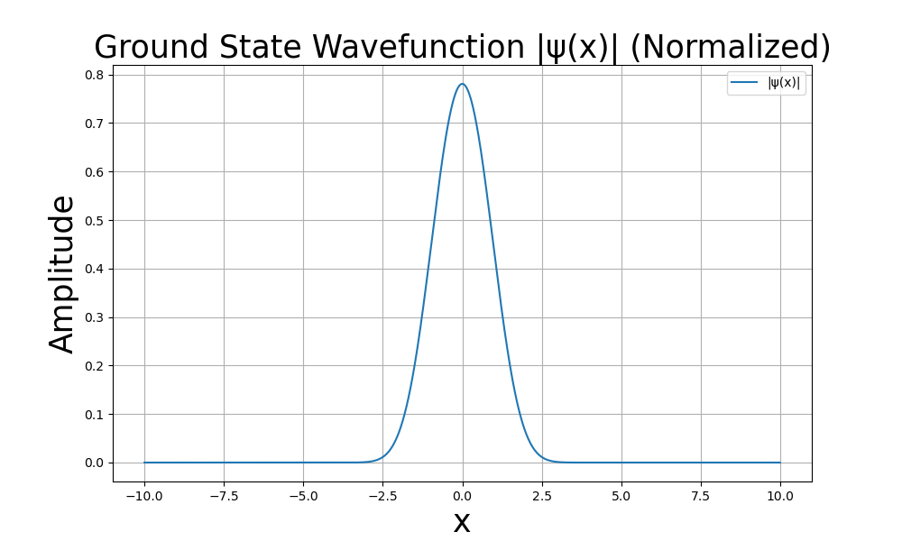

### 3.求解1-4激发态的本征能量和波函数

第一激发态到第四激发态的本征能量为：$E_1=1.7705$,$E_2=3.1403$,$E_3=4.6314$,$E_4=6.2237$
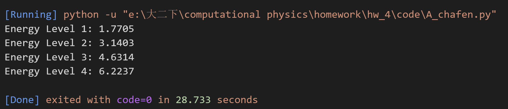
波函数**绝对值**的图像为：
第一激发态：
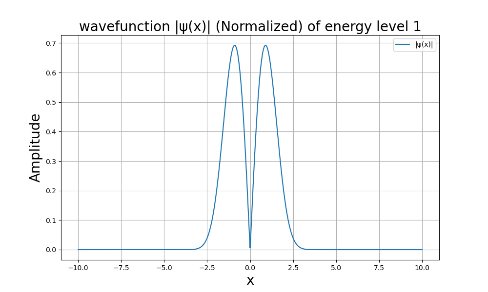
第二激发态：
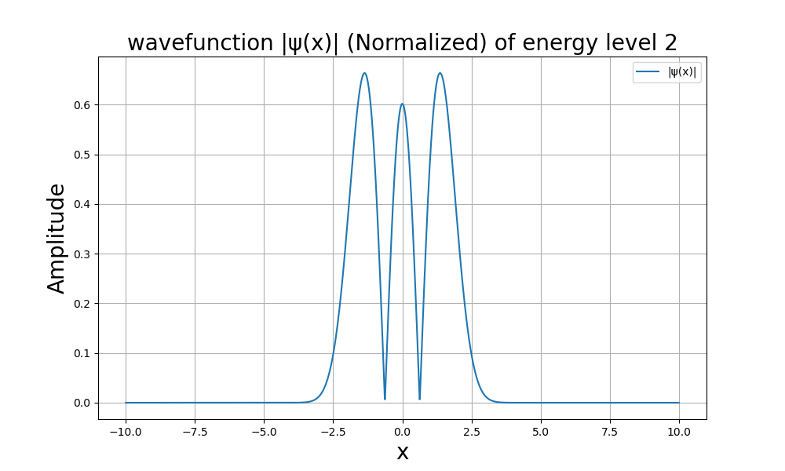
第三激发态：
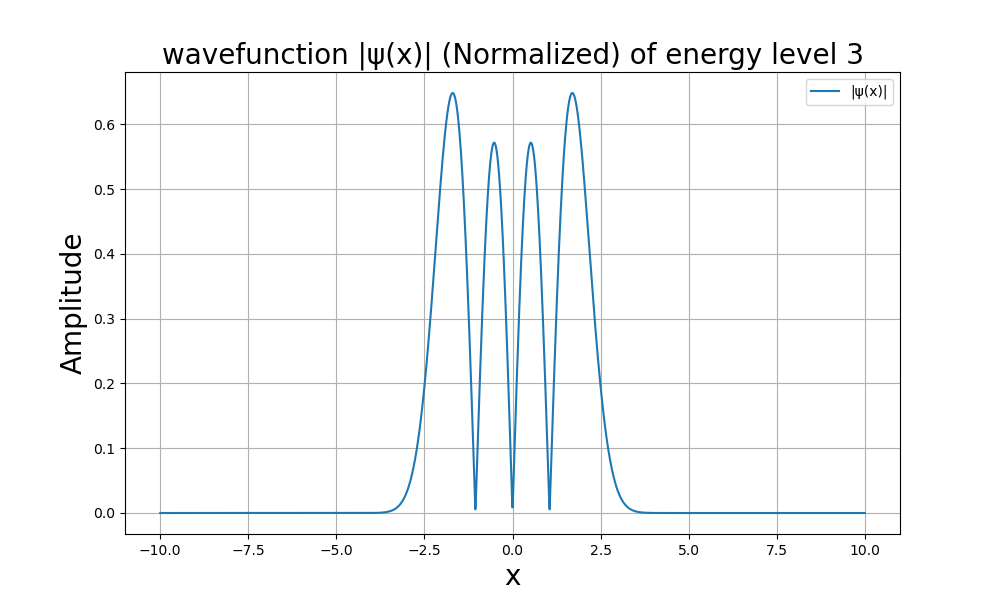
第四激发态：
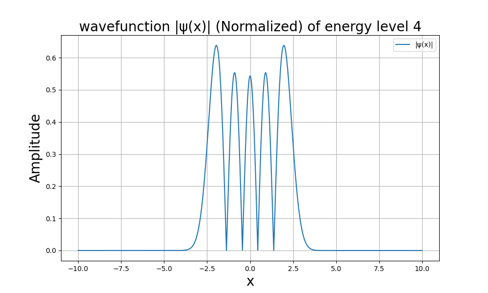
### 4.和简谐振子$v=\frac{1}{2}x^2$的比较
简谐振子$v=\frac{1}{2}x^2$的情况下波函数是有解析解的，对于方程$$-\frac{1}{2}\frac{d^2}{dx^2}\phi(x)+\frac{x^2}{2}\phi(x)=E\phi(x)$$有解析解,
波函数的推导如下：
利用变异系数法，波函数：
$$ \phi(x) = A(x)e^{-\frac{x^2}{2}}$$
其中 $A(x) = \sum_{k=0}^{\infty} a_k x^k$
带入薛定谔方程可以得到：
$$a_{k+2} = \frac{2k+1-2E}{(k+1)(k+2)}a_k$$
可以发现，事实上求和不能加到无穷，否则波函数不收敛，也就是存在$a_n$不为0，$a_{n+2}=0$的情况：$$a_{k+2} = \frac{2k+1-2E}{(k+1)(k+2)}a_k=0$$
即$$E = k+\frac{1}{2}$$
由此得到本征能量的形式：
基态能量为0.5,第一激发态能量为1.5，以此类推。
不妨取$b_0=1,b+1=2$,我们也得到了波函数的解析解：
$$ \phi_i(x) = \sum_{k=0}^{i} \frac{1}{\sqrt{2^kk!\sqrt{\pi}}}e^{-\frac{x^2}{2}}A(x)$$
这里的A(x)的截断取决于本征能量的大小。

利用得到的解析解，画出A中所提到的势函数和简谐振子两种情况下的波函数的绝对值如图所示：
对于基态：
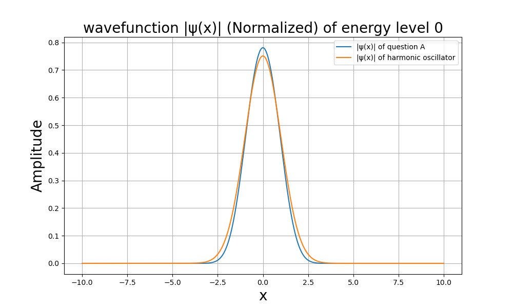
对于第一激发态：
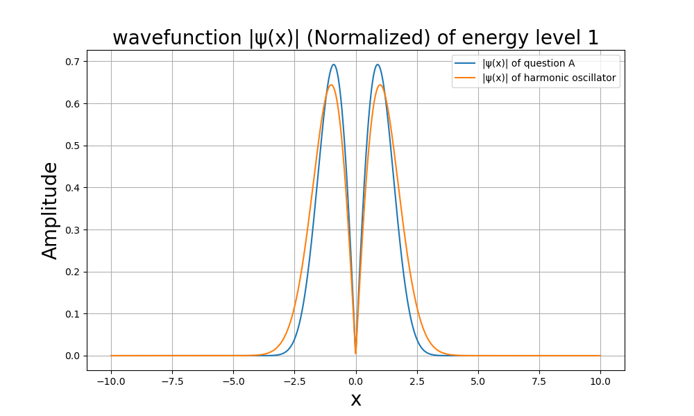
对于第二激发态：
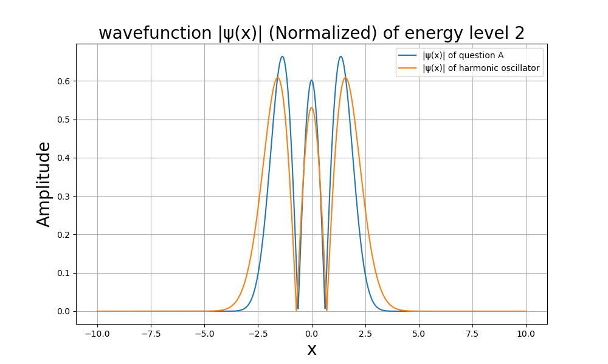
对于第三激发态：
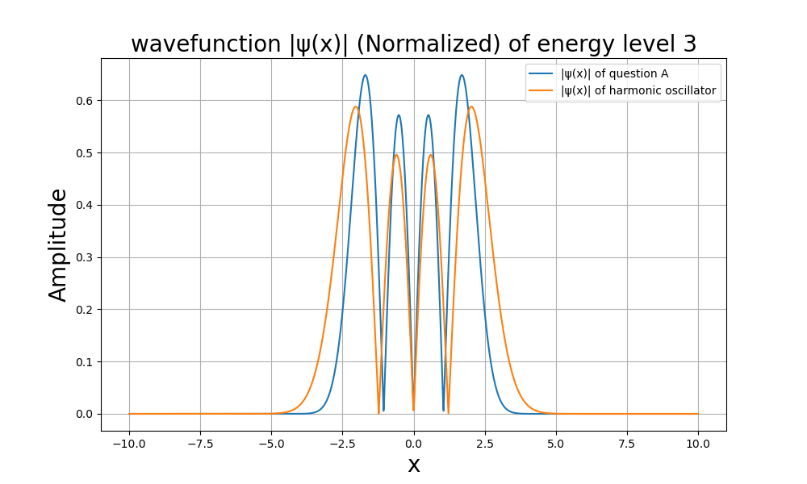
对于第四激发态：
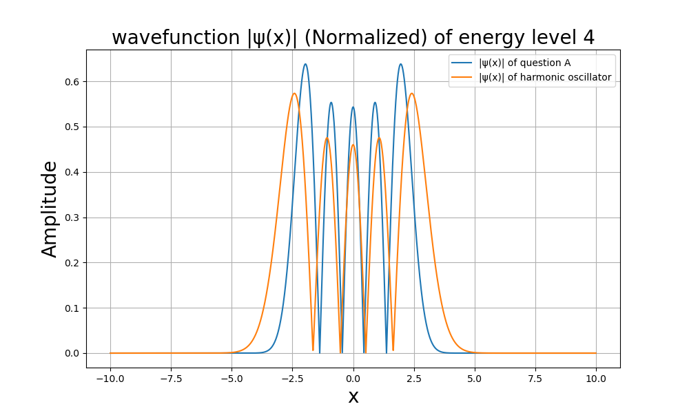

我还通过前述差分的方法求出了简谐振子的本征能量作为验证：

由图中结果可以看出，简谐振子的本征能量确实为：$$E_n = \frac{1}{2}+n$$与前面理论分析符合。
二者对比可以发现：
1. 对于同为基态或者相同的激发态，A中所提到的势函数对应的本正能量更大，能级不等间隔，而且能级越大，能级间距越大。这可能是因为势函数中的$x^4$项，使得势函数比间歇振子的势函数更大且更陡峭。
2. 二者的波函数的节点数都等于对应的能级数，例如基态都只有一个节点。
3. 二者的波函数的绝对值都是关于y轴对称的，这是因为二者的势函数都是偶函数，波函数符合奇宇称或者偶宇称。
4. 对于同一个节点，A中给出的势函数的波函数的波峰位置更加向中心靠拢，波峰的高度也高于简谐振子。这是由于A中的势函数有$x^4$项，势函数更加陡峭，粒子有更大的概率分布在中心位置

### 5.其他方法求解
前面在（1）中已经给出多种方法及具体思路，代码在附录。这里直接分析各种方法的优劣：
#### 算法一：打靶法（射击法）
优点：

- 对于单个本征值（尤其是基态或低阶激发态）计算效率更高。

- 直接利用了波函数的简便性（偶函数/奇函数），降低了计算的复杂度。

- 很容易实现，尤其是结合龙格库塔法的数值稳定性强。

缺点：

- 对于高阶激发状态，割线法可能需要多次迭代，且容易跳过某些本征值。

- 如果最初猜测的本征值较低，可能导致收敛缓慢或失败。

- 依赖最终条件设定，可能存在人为偏差。

- 对于非精确势场或复杂势函数，使用此方法时可能会比较麻烦。

- 适合西南低阶本征值和势简单场问题（如谐振子、方势垒等）。

- 不适用于多维势场或快速振荡的波函数。

#### 算法二：匹配法（Matching Method）
优点：

- 本征值寻求更稳定，尤其在高层本征态时更容易找到正确的解。

- 通过精确性和匹配条件，避免了在高阶激发状态中割线法可能出现的“跳过本征值”问题。

- 使用了匹配函数$f(E)$，对本征值的判定更具有洞察力，适用于复杂趋势场。

缺点：

- 数值实现比较复杂，需要两次积分并搭配割线法。

- 如果积分积分范围不充分（即L选得不够大），配合任务可能扩大。

- 初始本征值猜测较低时，可能导致更多的积分和迭代次数。

- 更适合复杂趋势场、非精确趋势场，或者高阶本征态的精确仿真。

- 对于基态也表现良好，但可能比打靶法稍微慢一些。

#### 算法三：矩阵本征值法（Matrix Eigenvalue Method）
优点：

- 该方法将问题离散化，转化为标准的矩阵本征值问题，数值稳定性强。

- 矩阵的稀疏性可以利用高效的稀疏矩阵算法（如scipy.sparse.linalg）加速流程图。

- 一次可得到所有本征值和本征函数，无需再单独猜测每个本征值。
- 数值稳定性优异，特别适合计算高阶本征值。
  
缺点：

- 空间网格划分太粗会导致不准确，太细则增加计算量。

- 对于非常陡峭的势能函数（如深势汲），需要更密集的网格点。

## B.格点上的单粒子动力学

算法解析：
处于提高运算速度的考虑，可以使用哈密顿量的矩阵形式：
$$H =
\begin{bmatrix}
0 & -1 & 0 & 0 & \cdots & 0 & -1 \\
-1 & 0 & -1 & 0 & \cdots & 0 & 0 \\
0 & -1 & 0 & -1 & \cdots & 0 & 0 \\
\vdots & \vdots & \vdots & \ddots & \vdots & \vdots & \vdots \\
0 & 0 & 0 & \cdots & 0 & -1 & 0 \\
0 & 0 & 0 & \cdots & -1 & 0 & -1 \\
-1 & 0 & 0 & \cdots & 0 & -1 & 0
\end{bmatrix}
$$
这里的对角线为0，次对角线为-1，表示相邻格点之间的跳跃。
由薛定谔方程$$i\frac{\partial}{\partial t}\psi(t)=H\psi(t)$$可得$$\psi(t) = e^{-iHt}\psi(0)$$其中这里的H即为上面的矩阵形式。

### 1.画出几个时刻的粒子密度分布
通过前述算法，
t=1:
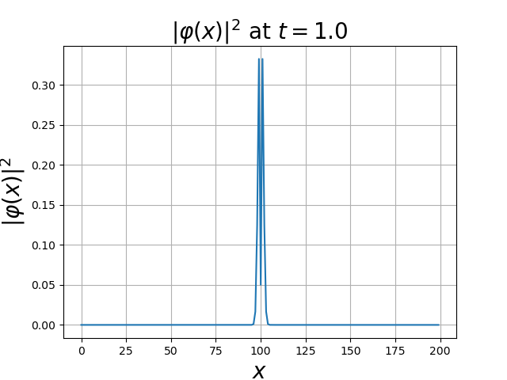
t=10:
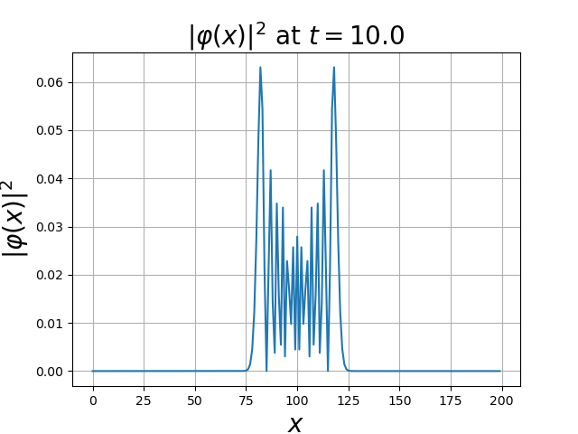
t=20:
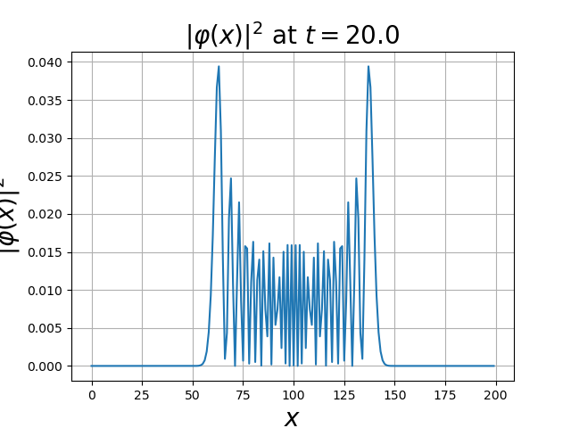
t=50:
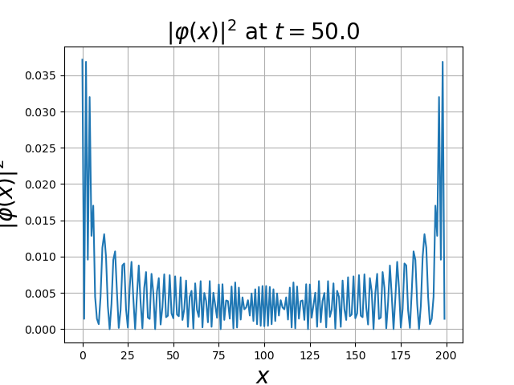

### 2.画出波包宽度随时间的变化
波包宽度定义为：
$$w(t)=\sqrt{\sum_i(i-i_0)^2\rho_i(t)}$$
得到时间范围内的波包宽度随时间的变化为：

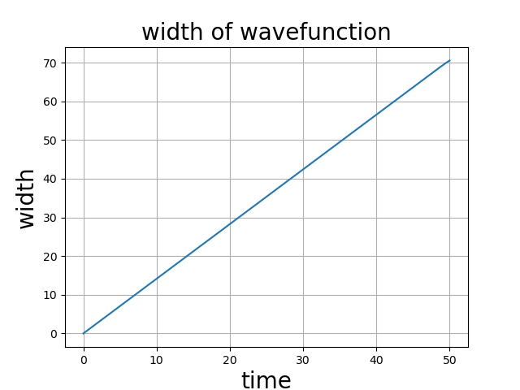

### 3. 画出求解时间内起始点粒子密度随时间的变化

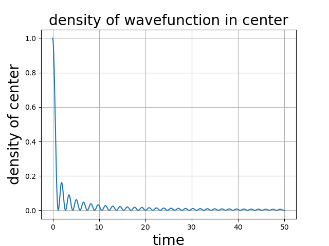

### 4. 解释现象
